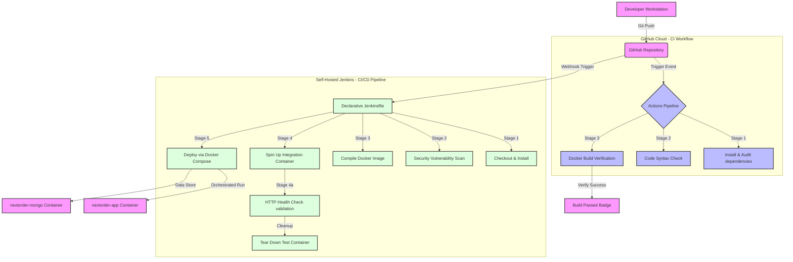

# NextOrder DevOps Integration Showcase

This guide provides a comprehensive overview of how **NextOrder** (a modern Kitchen Management System) integrates industry-standard DevOps tools: **Docker & Docker Compose**, **GitHub Actions**, and **Jenkins**.

---

## 🏗️ DevOps Architecture Diagram

Below is the visual workflow showcasing how your code flows from a developer's machine through automated continuous integration (CI) environments and onto the production server using Docker containerization.



---

## 🐳 1. Containerization (Docker & Docker Compose)

Docker packages NextOrder and its configurations into a lightweight, standalone, executable image. This guarantees that your application behaves exactly the same on any machine (development, CI server, production).

### The Configuration Files
- **[Dockerfile](file:///d:/COLLEGE%20STUDY/Previous%20Lecture%20PPTs/SEM-5/INT%20222%20-%20Advanced%20Web%20Development/CA%202/nodeproject/Dockerfile):** Builds on `node:20-alpine`, uses cached package layer dependencies (`npm ci --only=production`), sets production environment flags, and specifies an active **HEALTHCHECK** routine that monitors if the app is serving pages successfully.
- **[docker-compose.yml](file:///d:/COLLEGE%20STUDY/Previous%20Lecture%20PPTs/SEM-5/INT%20222%20-%20Advanced%20Web%20Development/CA%202/nodeproject/docker-compose.yml):** Automates launching the Node web server and an isolated MongoDB container simultaneously. It maps ports, defines a shared network (`nextorder-network`), and persists database storage inside a named volume (`mongo-data`).
- **[.dockerignore](file:///d:/COLLEGE%20STUDY/Previous%20Lecture%20PPTs/SEM-5/INT%20222%20-%20Advanced%20Web%20Development/CA%202/nodeproject/.dockerignore):** Prevents large folders (`node_modules`), documentation, and secrets from bloat-loading the docker compiler context.

### Commands to Run and Demonstrate Locally

To verify containerization locally, run these commands inside your workspace directory:

```bash
# 1. Build the Docker image from scratch
docker build -t nextorder-app .

# 2. Check the built image list
docker images

# 3. Spin up the application and database together in detached mode
docker-compose up -d

# 4. View active running services
docker-compose ps

# 5. Review containerized application logs live
docker-compose logs -f nextorder-app

# 6. Verify container health status (wait 30s to see "healthy" tag)
docker ps --format "table {{.Names}}\t{{.Status}}\t{{.Ports}}"

# 7. Take down and clean up containers
docker-compose down
```

---

## 🚀 2. Continuous Integration (GitHub Actions)

GitHub Actions is a cloud-based CI/CD system built natively into GitHub. Whenever you push code, GitHub spins up temporary Linux VMs to test it.

### The Pipeline Config
- **[.github/workflows/devops.yml](file:///d:/COLLEGE%20STUDY/Previous%20Lecture%20PPTs/SEM-5/INT%20222%20-%20Advanced%20Web%20Development/CA%202/nodeproject/.github/workflows/devops.yml):** Defines a multi-job build process:
  1. **Job 1 (Code Quality):** Pulls down repository, sets up Node 20, installs dependencies, runs dependency security scanners (`npm audit`), and checks for syntax compilation issues (`node --check server.js`).
  2. **Job 2 (Docker Verification):** Installs Docker Buildx setup, sets up multi-architecture compilers, builds the Docker image locally using GHA cache to guarantee it compiles without any broken imports or dependency mismatches.

### How to Demonstrate
1. **Initialize Git & Commit Files:**
   ```bash
   git init
   git add .
   git commit -m "feat: integrate docker, github actions and jenkins"
   ```
2. **Push to GitHub:** Create a new repository on your GitHub account, link it as remote, and push:
   ```bash
   git remote add origin https://github.com/yourusername/nextorder.git
   git branch -M main
   git push -u origin main
   ```
3. **Inspect Pipeline:** Go to the **Actions** tab on your GitHub repository page. You will see the **NextOrder Continuous Integration** workflow trigger instantly, showing a live visualization of the code audit and container build jobs completing.

---

## ⚙️ 3. Continuous Integration & Deployment (Jenkins)

Jenkins is the leading self-hosted automation server. It excels in hosting local build lines, private enterprise environments, and performing automated deployments.

### The Declarative Jenkinsfile
The **[Jenkinsfile](file:///d:/COLLEGE%20STUDY/Previous%20Lecture%20PPTs/SEM-5/INT%20222%20-%20Advanced%20Web%20Development/CA%202/nodeproject/Jenkinsfile)** defines a 6-stage lifecycle using pipeline-as-code:
1. **Checkout:** Clones the code.
2. **Install:** Installs core libraries.
3. **Security & Code Audit:** Performs security scans.
4. **Docker Build:** Compiles the app container image.
5. **Integration Testing:** Starts the container locally in isolated test mode, waits 5 seconds for initialization, runs a `curl` against `http://localhost:3000/health`, verifies a `200 OK` status, and then cleanly terminates and removes the test container.
6. **Deploy:** Executes `docker-compose up -d --build` to automatically deploy the healthy backend and MongoDB instances.

### Step-by-Step Jenkins Server Setup Guide

To demonstrate Jenkins running locally:

#### Step 3.1: Run Jenkins Container
You can run Jenkins easily inside a Docker container:
```bash
docker run -d -p 8080:8080 -p 50000:50000 --name jenkins-devops -v jenkins_home:/var/jenkins_home -v /var/run/docker.sock:/var/run/docker.sock jenkins/jenkins:lts
```
*(Note: Mapping `/var/run/docker.sock` allows the Jenkins container to command the host's Docker engine to compile and test images!)*

#### Step 3.2: Unlock Jenkins
1. Open your browser and navigate to `http://localhost:8080`.
2. Retrieve the setup password from container logs:
   ```bash
   docker logs jenkins-devops
   ```
3. Copy the password, paste it in Jenkins, and install **Suggested Plugins**.
4. Create an Admin User account.

#### Step 3.3: Install Necessary Plugins
In your Jenkins dashboard:
1. Go to **Manage Jenkins** -> **Plugins** -> **Available Plugins**.
2. Search and select:
   - **NodeJS Plugin** (handles node runtimes).
   - **Docker Pipeline** (enables native docker statements in pipelines).
3. Click **Install** and restart Jenkins.

#### Step 3.4: Configure NodeJS in Jenkins Tools
1. Go to **Manage Jenkins** -> **Tools**.
2. Scroll to **NodeJS installations**.
3. Click **Add NodeJS**, name it `node20`, select version `NodeJS 20.x.x` (or let it auto-install), and save.

#### Step 3.5: Create and Run the Pipeline Job
1. In the dashboard click **New Item**.
2. Enter Name: `nextorder-pipeline`, select **Pipeline**, click **OK**.
3. In the Configuration page:
   - Scroll down to the **Pipeline** section.
   - Set **Definition** to: `Pipeline script from SCM`.
   - Set **SCM** to: `Git`.
   - Enter your Repository URL (e.g. `https://github.com/yourusername/nextorder.git`).
   - If public, credentials aren't needed. If private, add your credentials.
   - Set **Script Path** to: `Jenkinsfile`.
4. Click **Save**.
5. Click **Build Now** to trigger the pipeline! Watch the stage view execute each step, run the integration health check, and deploy the application live.

---

## 🏆 Key Architectural Advantages Demonstrated

1. **State-of-the-Art Health Checking:** The addition of the `/health` route in `server.js` enables both Docker container supervisors and the Jenkins testing stage to accurately gauge the application's health status before releasing it.
2. **Environment Consistency:** Docker ensures that dependencies are exactly matching between developers, GitHub Action containers, and the Jenkins deployment targets.
3. **No Setup Onboarding:** A new developer can download your project and get it running with a single command (`docker-compose up -d`), without needing to install Node, MongoDB, or create environment config files.
4. **Enterprise CI/CD Separation:**
   - **GitHub Actions** serves as a lightweight, cloud-based CI gatekeeper that checks pull requests before they are merged.
   - **Jenkins** operates as a self-hosted CD engine that performs deep integration tests and handles server-local compose container deployment.
