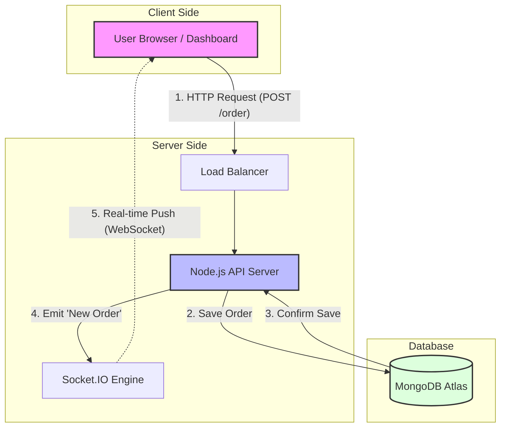
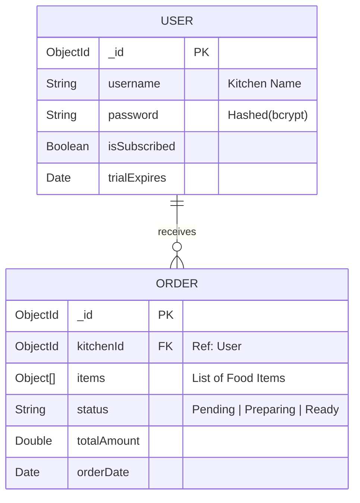

# Visual Assets for NextOrder Presentation

Here are the Mermaid diagrams and Code Snippets for your presentation.

## Slide 8: System Architecture Diagram



---

## Slide 9: Database & API Design

### Database Schema (ER Diagram)



### API Structure Visualization

```mermaid
graph LR
    API[REST API]
    
    API --> Auth[Auth Routes]
    Auth --> Login POST:/auth/login
    Auth --> Reg POST:/auth/register

    API --> Order[Order Routes]
    Order --> Live GET:/orders/live
    Order --> Create POST:/orders/new
    Order --> Status PUT:/orders/:id/status
    
    API --> Report[Report Routes]
    Report --> Daily GET:/reports/daily
```

---

## Slide 10: Core Implementation Highlights

Here are the code snippets you can screenshot.

### 1. Authentication Middleware
*Located in: `routes/orderRoutes.js`*

```javascript
// Middleware to protect routes using JWT
function authMiddleware(req, res, next) {
    try {
        const authHeader = req.headers.authorization;
        // Check if token exists
        if (!authHeader || !authHeader.startsWith('Bearer ')) {
            return res.status(401).json({ message: 'No token provided' });
        }

        // Verify Token
        const token = authHeader.split(' ')[1];
        const decoded = jwt.verify(token, process.env.JWT_SECRET);
        req.userId = decoded.userId; // Attach user to request
        next();
    } catch (error) {
        return res.status(401).json({ message: 'Invalid token' });
    }
}
```

### 2. Real-Time Socket Emission
*Located in: `routes/orderRoutes.js`*

```javascript
// Create new order and emit real-time event
const newOrder = await order.save();

// Emit socket event to connected clients
const io = req.app.get('socketio');
if (io) {
    io.emit('new-order', newOrder);
}
```
